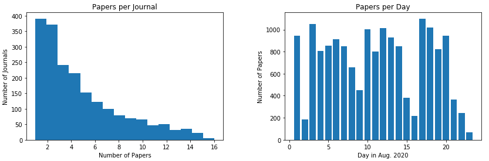
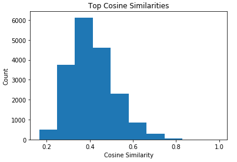

# The Academic Journal Article Recommender System (AJAR)

- [Problem Statement](#Problem-Statement)
- [Project Summary](#Project-Summary)
- [Project Files](#Project-Files)
- [Data Dictionary](#Data-Dictionary)
- [Data Collection](#Data-Collection)
- [Exploratory Data Analysis (EDA)](#Exploratory-Data-Analysis-(EDA))
- [AJAR Application](#AJAR-Application)
- [Conclusions](#Conclusions)

---

### Problem Statement

Keeping abreast of the current state of scientific progress is essential for any researcher in order to stay at pace with their peers in their area of expertise. However, the amount of scientific reports has been increasing each year, with current estimates at over 2 million articles published a year. Combing through journals to find papers of interest is occupying more of a researcher's time than ever before, which takes away time that could be spent conducting studies and experiments. Facilitating effective and time-efficient methods of literature searching will be of tremendous help in allowing academics to conduct the work they need to.

---

### Project Summary

I have developed an application, the Academic Journal Article Recommender (AJAR) app, which is a system capable of automatically providing recommendations for suggested readings to a user based on their previously saved literature. The system is publicly available on the internet for free, and currently has an archive of nearly 20,000 academic articles. Natural Language Processing (NLP) is utilized to analyze a user's favorited papers and generate recommendations based on cosine similarity. Each paper also has up to five similar articles displayed, in order for users to easily browse a wide catalogue of work on a particular topic. Data is collected using the Springer API, and links to the full article are provided if the user is sufficiently interested in the article at hand.

---

### Project Files

The project files are organized as follows:  

**Main Directory/**  
- README.md: Project summary document (this file)
- [presentation.pdf](presentation.pdf): Project presentation slides    
- **code**/
    - [eda.py](eda.py): Notebook containing code for initial data collection, data cleaning, and exploratory data analysis on that initial corpus
    - [clustering.ipynb](clustering.ipynb): Notebook code for creating NLP features and assessing parameters for optimal clustering of user favorites
    - [daily_collection.py](data_collection.py): Python script to be run daily, which pulls papers from the previous day and applies the same cleaning and feature processing, then adds this data to the archived data
    - [app.py](app.py): Python script which controls the front end application, answering user requests
    - **templates**/ Folder containing the html scripts for displaying the application
- **data**/
    - [papers.csv](papers.csv): CSV file containing all the data gathered during the initial data scrape. A backup to prevent the need to scrape again
    - [vectorizer.csv](vectorizer.csv): CSV file containing the pickled Tfdif-vectorizer fit. Allows for easy feature processing of new data
    - [features.npz](features.npz): NPZ file containing the sparse matrix with the feature results generated by Tfdif vectorizer. The version here is a static file (up to date as of 09-08-20), but the feature file on the application virtual machine is updated daily
- **images**/
    - Figures and charts referenced in project summary document

---

### Data Dictionary

Each article has the following data recorded, although only the abstract was used for NLP

|Feature|Type|Description|
|---|---|---|
Title|str|The title of the article
Journal|str|Journal that the article was published in
Date|str|Publication date in YYYY-MM-DD format
Authors|str|List of authors
Abstract|int|Full abstract for each article
Link|str|Hyperlink reference to the full article if the user wants to read the full paper
ID|int|Unique reference number for reference purposes by the application. Assigned during data collection

---

### Data Collection

Journals articles are collected using the [Springer Nature API](https://dev.springernature.com/). An initial corpus of approximately 27,000 articles was generated at the start of the project, which was reduced to 18,000 articles following data cleaning. This data was generated from only the month of August, 2020. While eventually it will increase the power of the application to include more articles from the past, due to the volume of data for the initial launch, it was decided to limit the initial data collection to this data set. Additional articles are gathered each day and added to the database, after being subject to the same processing prcedure that the initial data set was.

---

### Exploratory Data Analysis (EDA)

While exploring larger trends within the data itself is not the objective of the project, it is still useful to for evaluating the papers that are collected day to day. I looked at the number of articles for each unique journal in the data (Fig. 1, left). The distribution shows that most journals are represented by only one or two papers, which is likely indicative of missing data, as it is likely that there are many more articles published by these journals. Again, these numbers also must take into account the fact that data only begins from August of 2020, so these numbers would increase overall as more data is collected. The second distribution shows the publication of papers by day (Fig 1. right). As would be expected, there is a seasonality to the data, with publications dropping over the weekend. On average, a typical weekday generates around 700 papers. This can be used to assess if a particular daily pull is far outside of this range, which could be indicative of an error in the collection process or other extenuating circumstance (for example, only 61 papers were gathered from labor day).

**Figure 1**. Paper publication rates by journal and day

---

### Data Clustering

Since it would be time consuming to run feature creation each day when new data is collected, the initial data set of ~18,000 papers was used to fit the vectorizer which is then applied generally for all future papers. This fit "model" is pickled and utilized during the daily collection. These features are then compared with one another to generate cosine similarity scores between papers. This score is used to determine which papers to recommend. After observing the distribution of scores (Fig. 2) for the initial data, a cutoff score of 0.3 was selected to determine if a paper was sufficiently similar enough for recommendation.

**Figure 2**. Cosine similarity score distribution

For the purposes of daily recommendations based on a user's saved articles, I am interested in trying to cluster those articles because often times researchers will be searching for papers on several different topics at once. Rather than try to match each paper individually, clustering would allow for matching against the overall features of the group, which would help mitigate "outliers," or papers that may have hyper-focused topics. Instead, I am looking to parse more general trends.

A K-Means clustering model was employed for users with more than five favorited papers. Models with clusters ranging from 2 to 5 are tested and measured based on silhouette score, with the number of clusters with the best score being ultimately used.

---

### AJAR Application

The AJAR application can be accessed online at the ip address **18.220.169.23**

The application is hosted by an Amazon Web Services EC2 instance, which conducts the daily paper collection as well as conducting all back-end operations. The process diagram for the application is described in figure 3.

**Figure 3**. AJAR application process diagram

AJAR supports a range of functionalities:

**Searchable archive**: Users are able to conduct searches for terms of interest as well as articles from specific date ranges or journals. Whenever a paper is viewed, the application will also provide other papers that share similar features.

**User favorites**: Users can save papers of interest for ease of reference. This pool of articles is also how AJAR determines whether a paper from the daily collection might be of interest to the user.

**Journal searching**: Since AJAR pulls from a multitude of different journals, users can also search for journals that may overlap with their interest, and pull up all of the articles published by a specific journal.

**Daily recommendations**: Papers published from the previous day that align with the articles saved by the user. This process is automatic and is displayed on the user's home screen, providing a quick and easy method for user's to find articles of interest.

---

### Conclusions

AJAR is a tool to help researchers across all disciplines spend more time doing research, while still effectively keeping apace of advances in their fields. As it currently stands, AJAR is fully functional and can already provide value for researchers by automating the process of finding relative articles in a timely fashion. As more papers are added to the database, this will only increase the amount of information that users have access too.

There are still many improvements that can be made to the current implementation. Some possible avenues include improving the recommendation process. As it stands, both feature generation and measuring similarity (cosine similarity) are fairly rudimentary. Incorporating or engineering additional features to include could help increase the quality of the recommendations. Another avenue for improvement would be to track meta-data such as authors, as these are another method of linking papers of similar topics to one another, as each author is likely to publish in similar areas of work

Overall, AJAR is a firm foundation for creating a system to help improve the efficacy and output of researchers in all areas of study. As the project develops, the uses provided will continue to grow as well, and will hopefully become a widely utilized tool.